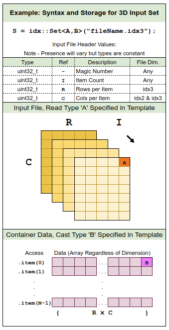

# IDX Import
## Reads and Formats Sets of 1-3 Dimensional Items as Indexed Vectors of Desired Type

#### Summary:

A simple header for importing "idx_" formatted sample data, which constitutes the MNIST data set. 
This is a non-standard format explained in further detail on Yan LeCun's archive (linked below).

http://yann.lecun.com/exdb/mnist/

#### Notes:

#### 1. Unit Testing

This was designed _specifically_ for loading the MNIST training / testing sets,
processing each image's native representation to yield a vector of normalized
floating point values for experimentation with neural networks. An effort was 
made to support idx files with formats beyond those present in the MNIST sets, 
(e.g. an idx2 file, or a set with data-type: double) but unit-testing clustered 
largely on importing and processing these sets alone.

#### 2. Data Portability

Idx file headers don't specify the endianness of their contents, though the sets 
within the MNIST archive are all big-endian. A relatively fast automatic register
class is implemented in the reader as idx::AutoEndianBuffer<type>() which finds
endianness on initialization and formats idx files originating from big-endian 
machines. This occurs for _all_ files when reading the header (contains multi-byte
fields that describe subsequent data) but will be skipped entirely for read-format
specifiers of size == 1.

#### 3. Read and Access Syntax
  
I've made a basic illustration (see below) to illustrate syntax and data formatting when creating an idx::Set and extracting its contents as vectors.

